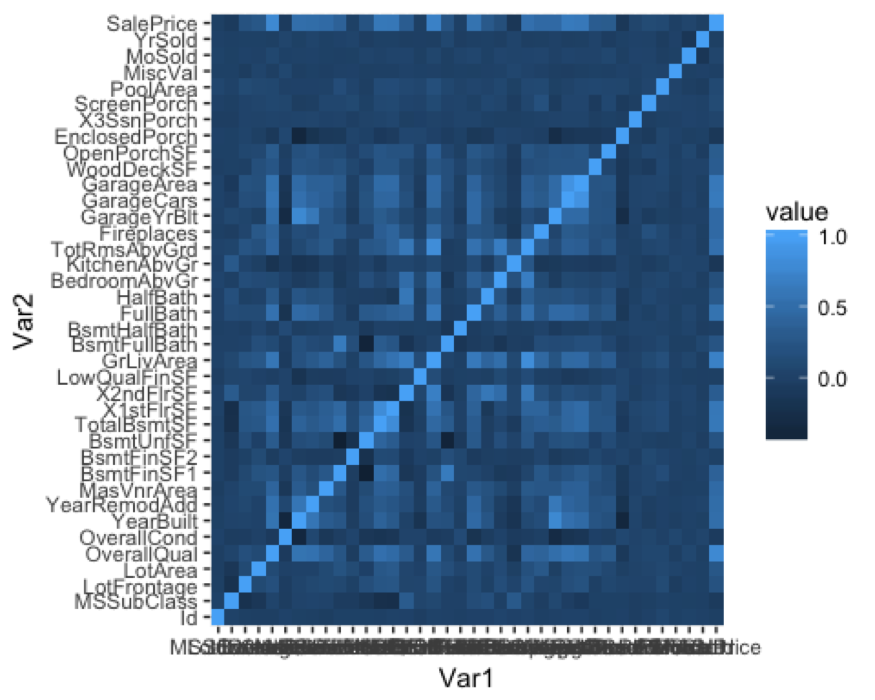
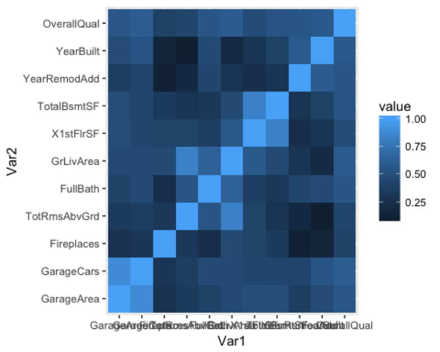
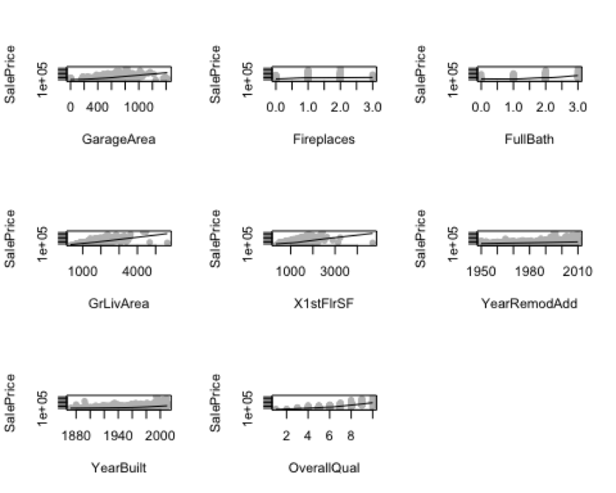
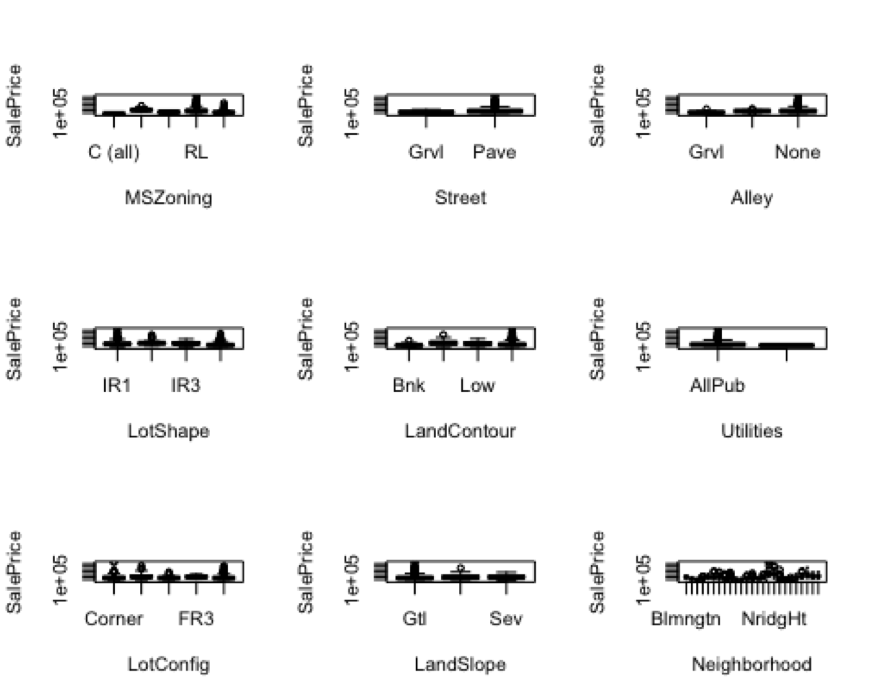

## Introduction
The goal for this project is to create a model that can predict the response variable (sale price) most accurately with a (relatively) small number of predictor variables. The dataset for this competition contains information on 1,460 residential homes with a total of 81 variables, such as the price that the home was sold for and characteristics of the house such as overall square footage, basement quality, and the type of exterior covering on the house. To keep my final model interpretable, I will choose a small subset of the 80 available predictor variables to use as covariates in the model. The predictor variables used in this model won'€™t be redundant and will have low correlation with each other. To do this, I will use manual feature selection, choosing only the variables that appear to have a strong effect on sale price and modifying certain categorical variables so that their levels are more intuitive. That way, I can achieve a balance between accuracy and complexity.

That being said, since there are other modelling techniques that result in models that are difficult to interpret but are potentially more accurate (in this case, regression trees, random forests, and neural networks), I will include all the information provided in the dataset to fit these models so that I have all the information potentially need to make the most accurate prediction. So, for this project, I will create one "interpretable model" and one black box model.

## Methods

I will fit a total of four models: a Generalized Additive Model (GAM), a regression tree, a random forest, and a neural network. As explained earlier, I will try to keep the GAM small and interpretable as possible while staying accurate.

### Data Cleaning
An initial exploration of the dataset makes it clear that there are many NA'€™s in the dataset. These NA's can signal important information for my models, so it is important that I properly address them before fitting a model.

The NA'€™s in many of the categorical variables indicated that what that variable was giving information about didn'€™t exist. For example, NA for Alley meant there was no Alley. So for these variables, I added a new category named "None"€� put all the observations with NA'€™s into that category for these variables. These variables are: Alley, BsmtQual, BsmtCond, BsmtExposure, BsmtFinType1, BsmtFinType2, FireplaceQu, GarageType, GarageFinish, GarageQual, GarageCond, PoolQC, Fence, and MiscFeature.

Similarly, for GarageYearBlt, NA meant there was no Garage, but since GarageYearBlt is a quantitative variable, I couldn'€™t add in a category, so I resorted to the single imputation method of replacing the NA'€™s with the mean of the column. 

Likewise, for Electrical, I added an '€œOther'€� category where I put all the observations with NA since NA didn'€™t necessarily mean that the house had no Electrical system. On the other hand, for LotFrontage, NA meant the house didn'€™t have a lot, so I changed all the NA'€™s in that column to 0. Both these approaches were different than how I treated MasVnrType and MasVnrArea, which had 8 observations that were NA. Since NA didn'€™t necessarily mean the house didn'€™t have any masonry veneer, and as 8 observations isn'€™t a significant amount in a dataset of 1460 observations, I decided to remove those rows and then further explore the dataset.

### Feature Selection

#### Quantitative Variables
The first step in building the GAM is to reduce the 81 variables into a subset that contains only the most important ones for predicting sale price. To do that, I first created a heatmap (shown below) with all of the quantitative variables in the dataset and looked at which ones were most correlated with sale price. I then looked at the correlation amongst the variables that I chose and eliminated some variables that were highly correlated with others in the chosen set. 

The variables that were most correlated with sale price (r>.8) are: GarageArea, GarageCars, Fireplaces, TotalRmsAbvGrd, FullBath, GrLivArea, 1stFlrSF, TotalBsmtSF, YearRemodAdd, YearBuilt, and OverallQual.

Looking at another heatmap with just these variables, I saw that Garage Area and GarageCars are correlated, so I removed GarageCars, which is a measurement of how many cars can fit in the garage. There are other pairs of variables, such as total number of rooms above ground and above ground living area, or total basement square footage and first floor square footage, that could potentially be correlated, but the relationships between these variables don'€™t seem as direct as garage area and the number of cars that fit in the garage, so I won'€™t remove any of these variables from my model.

The quantitative predictor variables are: Garage Area, Fireplaces, Total Rooms Above Ground, Full Bath, Above Ground Living Area, 1st Floor Square Footage, Total Basement Square Footage, Remodel Date, Year Built, and Overall Quality. Next, I thought about whether or not there are interactions between these variables and agreed that I should include an interaction term between year remodeled and year built. For example, if a house did not have any remodeling done, then it will have the construction date as its year remodeled. Therefore, I will create a spline for this interaction in my generalized additive model.

I examined scatterplots of the relationships between each variable and sale price (using the plotExplore() function, example below) and found that Garage Area, Year Built, and Overall Quality appear to have nonlinear relationships with sale price, so I will include those variables in the GAM (which fits nonlinear relationships as well) despite the low correlation (correlation only measures the strength of the linear relationship). 

#### Categorical Variables
To select the most impactful categorical variables, I used plotExplore() to find the categorical variables that appear to have the strongest influence on price, leaving out the ones whose means are similar across all levels of that variable. 

Ultimately, I decided that Exterior1st, Exterior2nd, Exterior Quality, Basement Quality, Kitchen Quality, Neighborhood, and Saletype seem to have the largest effects.

Some of these categorical variables were problematic when cross-validating, as some levels did not have enough observations to do cross-validation with. Therefore, I decided to re-categorize the variables, grouping them into a smaller number of buckets. For example, with the neighborhood variable, I grouped the neighborhoods in four buckets: Low, MidLow, MidHigh, and High, with each level being representative of the average house price in that neighborhood. 

### Model Fitting
Having selected the subset of features, I fit a GAM that includes the following variables: Garage Area, Fireplaces, Total Rooms Above Ground, Full Bath, Above Ground Living Area, 1st Floor Square Footage, Total Basement Square Footage, Remodel Date, Year Built, Overall Quality, Neighborhood, Sale Type, Exterior 1st, Exterior Quality, and Basement Quality.

Next, I created a regression tree, random forest, and neural network, all of which were built using all the provided variables in the dataset. I allowed each model to choose which variables were valuable to include through its own respective criteria. I used the train() command in the caret package in R to fit these models as well. This was an automated process for the regression tree and the random forest, and for the neural network I used JMP to examine different combinations of hidden layers and nodes in each hidden layer to determine the configuration that results in the lowest RMSE. After converting the categorical variables to dummy variables and using JMP for model selection, I came upon two potential models: either I could use all the variables in a neural network with a single hidden layer of 7 nodes, or I could use the exact same variables I used for my linear regression and GAM models in a neural network with two hidden layers with 3 nodes each. Both models had approximately equal RMSE and there was no clear winner. Keeping interpretability as a tiebreaker, I used created the neural network with the same variables as my linear regression model and had two hidden layers with 3 nodes in each layer.

## Results
After creating the models, I examined the 5-fold cross validation errors for each model to gauge their relative performance. Here are the RMS errors I found using 5-fold cross validation:

GAM: 35983.39

Regression Tree: 43597.32

Random Forest: 29547.63

Neural Network: 50198.56

Looking at the results, it appears the random forest resulted in the least root mean squared error, with an RMSE of \$29547.63. However, the far more interpretable GAM was the second best model in terms of RMSE and only marginally worse in prediction (the GAM'€™s RMSE is about \$6000 higher). While the RMSE for the random forest is slightly under $30,000, most of these houses sell for over \$150,000, and considering the intangible factors that affect selling price (ex. bargaining), the model is accurate to an acceptable degree.

## Conclusion
From the models that I created, I was able to get a sense of which variables affect sale prices the most. Looking at the regression tree, it appears that the most important variables are overall quality, exterior quality, garage cars, above ground living area, and year built, all of which was included in the GAM. It makes sense that all these variables have significant effects on sale price, but through my visual exploration of the predictor variables, I was also able to determine that variables related to location, such as neighborhood, and other features such as basement condition and size and kitchen quality are important. 
